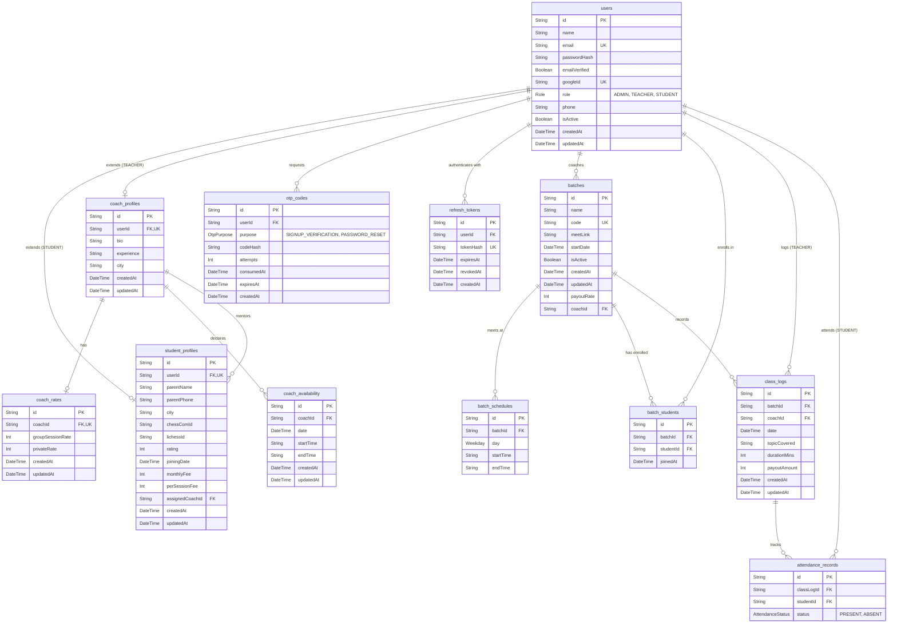

# Database Schema & ER Diagram

This document contains the Entity-Relationship (ER) diagram for the SMC CRM and a detailed breakdown of how data is stored in the database.

## ER Diagram

## Tables & Data Storage Details

### Core & Auth
1. **users**: The central table for authentication and identity. Stores credentials, role (`ADMIN`, `TEACHER`, `STUDENT`), and basic contact info. 
2. **otp_codes**: Stores one-time passwords (hashed) for email verification and password resets. Includes expiration time and attempt counts to prevent brute-forcing.
3. **refresh_tokens**: Stores hashed long-lived tokens allowing users to stay logged in securely without storing permanent session cookies.

### Profiles
4. **student_profiles**: Extends the `users` table for students. Stores parent info, chess ratings, Lichess/Chess.com IDs, and fee details. Linked 1-to-1 with a User.
5. **coach_profiles**: Extends the `users` table for coaches. Stores their bio, experience, and city.
6. **coach_rates**: Stores payout rates for coaches (group vs private sessions). Linked 1-to-1 with a CoachProfile.

### Scheduling & Batches
7. **batches**: Represents a recurring class. Stores the permanent Google Meet link, batch code, active status, and the assigned coach.
8. **batch_schedules**: Stores the weekly recurring schedule for a batch (e.g., Every MONDAY at 16:00). A batch can have multiple schedules.
9. **batch_students**: A join table mapping which students are enrolled in which batches.
10. **coach_availability**: Stores specific time slots when a coach has declared they are available to take new classes or demos.

### Logs & Attendance
11. **class_logs**: Created by a coach after a session. Acts as the official record of a class taking place, storing the topic covered, duration, and the payout amount locked in at that time.
12. **attendance_records**: Linked to a `class_log`. Stores the presence (`PRESENT` / `ABSENT`) of each student for that specific session.
